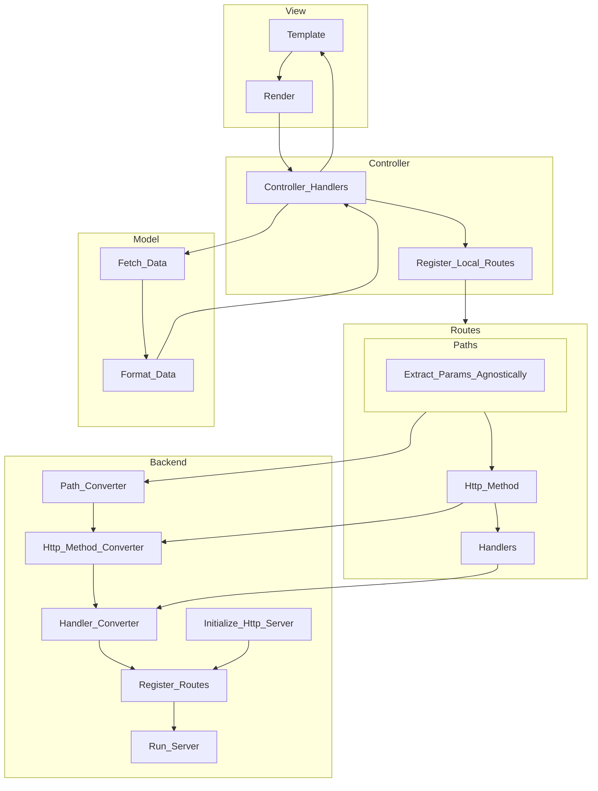

# swivel

A pluggable web framework

Matching CLI called revolve?


```rust
trait Controller {
  fn index() -> String {};
  fn show() -> String {};
  fn store() -> String {};
  fn create() -> String {};
  fn edit() -> String {};
  fn update() -> String {};
  fn delete() -> String {};
};
```

```rust
trait Middleware {
  fn handle() -> String {};
};
```

```rust
struct Router {
  routes: Vec<Route>,
};

impl Router {
  fn add_route() -> String {};
  fn get() -> String {};
  fn post() -> String {};
  fn put() -> String {};
  fn delete() -> String {};
};
```


```rust

trait Request {
  fn authorize() -> bool {};
  fn rules() -> Vec<Rule> {};
};

```

```rust
trait Model {

};
```


Maybe worth exploring this model: https://github.com/tokio-rs/axum/discussions/2184


It may also be worth looking into supporting different architectures: https://github.com/microsoft/cookiecutter-rust-actix-clean-architecture/blob/main/README.md

If support a variety of architectures, create some type of templating mechanism to generate boilerplate.

Perhaps the CLI could be configurable to provide certain boilerplate based on the architecture selected.


Separation of concerns:

- Model
  - Interacts with the database
  - Therefore it should only be interacting with the database, and returning data.
- Views
  - Interacts with the user
  - Therefore it should only be interacting with the user, and returning data.
  - The templating engine manages this. interchangeable templating engines.
- Controllers
  - Interacts with the model and the view
  - Therefore it should only be interacting with the model and view, and returning data.
  - Controller should be the only part that interacts with the backend.


In the MVC architecture at least, each of the three components are indepdendant of each other, except for the interop between.

Models and views should not be aware of each other (except maybe types), and controllers should be the glue between the two.


Things to reimplement:
- FromRequest
- IntoResponse


Common traits and between axum + actix-web:
- FromRequest
- IntoReponse
- Extractors
   - Somewhat related to FromRequest.
- State


If we are able to create our own IntoResponse, and then globally implement them for any type that implements IntoResponse, we can then use them in our controllers to return data. This would allow us to use any type of response, and then convert it to the appropriate response type for the web framework.


However: why implement something generically that can be generated non-generically.

Under the hood, axum handlers and actix request handlers are just async functions.


For any Input, or Output, we need to define translations between our own types and the types of the backend.


As much as we can things should be backend agnostic. Routes for example do not need to be generic in any case.

However handler functions within routes may need to be generic.


Perfectly translatable concepts:
- Actix scopes to Axum nested routes.
- Axum state and actix data.
- Differentiating HTTP


How about we just define our own response type that implements actix Responder and axum IntoResponse. Then we can just convert our response type to the appropriate response type for the backend.


Things that we will need to take into consideration:
- Handling different types of url parsing.
  - actix uses `/{user}/test` whereas axum uses `/:user/test`.
- Extractors for said URLS 
- Response types
- Middleware
- Request types
- custom FromRequest that can be implemented for our types.
- Implement FromRequest for ALL MODELS!
- Allows us to pass in some stuff.


- Create own FromRequest trait
- Implement FromRequest on extractors.
- Create Request struct.
- Create mapping from Request to backend Request.
- Create mapping From backend Request to Request.
- For any T that implements our own FromRequest, we can then implement the backend FromRequest for it.
- Alternatively, for every extractor, we implement our local FromRequest.


Approach to extractors:
- In Actix, the FromRequest trait has access to a reference of the entire httpRequest. Given that they have a custom implementation of the HttpRequest, they can then extract the data from the request.
- In axum, they rely on the http crate for their type definitions. To get the request as a http crate type. This type is the http::Parts type. This type is essentially the same (under the hood its just a big struct referencing all componenets).

If we reimplement all the common extractors on our own types, for whatever backend we have, it should be a lot nicer.

To make life significantly easier, I think that it would jist be easier to use the http crate, as that defines a really nice Request and Response values. This would allow us to use the http crate for our own request and response types, and then we can just convert these to the appropriate types for the backend.

the http create also provides us with methods.





What should the DX be?
- Create a backend in the main file.
  - Backend provides:
    - Ability to start the server.
    - Ability to add routes.
    - If we have a route type, then we can just map from our route types to the route types of the backend that we choose.


Backend trait should define API for variety of things:
  - Adding routes
  - Starting the server
  - Adding middleware
  - Adding state
  - Setting Headers
  - Setting Cookies


### Ethos

We want minimal work for the user, whilst achieving maximal work for the user. Abstractions should be kept at a minimum. 

Any extensions that we want to create for our user-space should then work in both actix and axum.


### User facing APIs that we need to implement:

- Router
- Handlers
- Extractors
- Request / response types.
- Middleware
- State (not really just a parser for handing it down to backend)

We only really need to deal with the user facing APIs. Implementing stuff like handlers is overkill for our purposes and would be a waste of time realistically.

Axum:
- Router
  - Routing with get() and post()
  - Nested routes
- Handlers, these are just async functions, the glue that holds everything together. 
    - They take in a bunch of extractors, 
    - and return something that implements IntoResponse
    - If we have a function that meets these requirements, then we have a handler.
- Extractors
  - Extractors are an essential part of the user-space for axum. It allows http parts to be extracted from the main request.
- Requests and responses.
  - Requests coming into functions should ALWAYS be of the same type, no matter the backend.
  - Response types should always be the same simple type (or trait).
    - If we implement IntoResponse and Responder for all of our types, then we have a ok response.
- Middleware
  - Middleware in axum is the same as a tokio layer. I think that for us, (at least for now). implementing middleware with from_fn is the easiest way to go about it.


Actix:
- Router is slightly different but basically the same functionality


How should things be structured?
In my opinion, a service should take in an input with a request type, and return a future with a
response type.

The service itself should be responsible for calling it's own handlers etc.
A handler should merely take in the arguments that it requires, and run it's asynchronous
operations on those arguments.

This means that the service should be responsible for converting the request into the arguments
that it's handlers require.

This is similar to what actix does under the hood, and I think that it is better practice and an
overall nicer abstraction.

However this does introduce additional complexity to the situation.
This means that we will need to implement an AxumHandler for every swivel service, and then call
our handler withing that.
