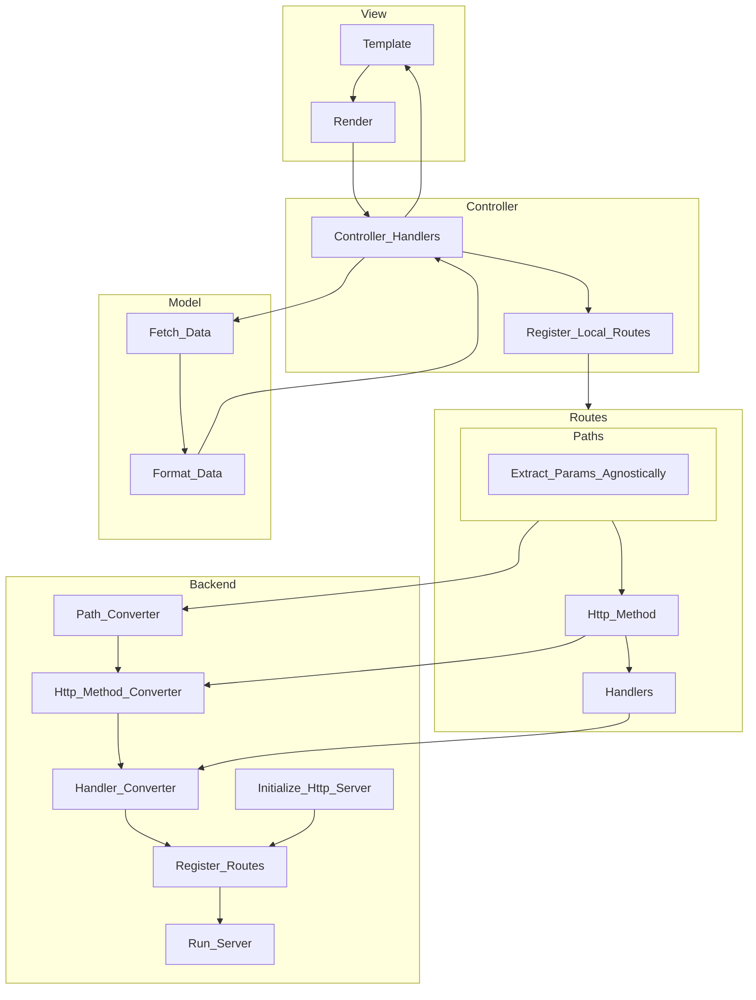

# Design Document for Modular Code Generation Library

## Overview
This document outlines the design of a modular code generation library that facilitates creating, managing, and extending code generation modules. The library is designed to ensure flexibility, reusability, and scalability while addressing common issues in modular code generation workflows, such as dependencies, configuration, and extensibility.

## Goals
1. **Modularity**: Provide a structure where modules can be created, extended, and reused without tight coupling.
2. **Extensibility**: Allow users to define their custom behaviors and integrate new modules with minimal effort.
3. **Configurability**: Ensure that the system can be configured programmatically, providing users with complete control over their generated code structure and dependencies.
4. **Scalability**: Support projects of varying sizes and complexities without sacrificing performance or usability.
5. **Reproducibility**: Maintain consistent generation outputs across environments to enhance reliability and reduce errors.
6. **Minimal Coupling**: Avoid creating a central module that ties everything together, ensuring that modules remain independent.

## Core Concepts
### 1. **Module System**
Modules are the building blocks of this library. Each module encapsulates specific functionality and defines how code is generated for a particular domain or feature. Modules may:
- Define templates for generating code.
- Implement behaviors to modify or extend generated outputs.
- Provide hooks or APIs for external configuration.

### 2. **Dependency Management**
Modules can declare dependencies on other modules. These dependencies ensure that the necessary modules are loaded and configured before a dependent module executes its logic. The library will:
- Resolve dependencies at runtime.
- Prevent circular dependencies.
- Validate that dependent modules are correctly configured.

### 3. **Configuration**
The library allows programmatic configuration of modules and their behaviors. Users can pass in:
- Paths and file structures for generated outputs.
- Custom options or functions to adjust module behaviors.
- Routing tables to specify where generated components should be placed.

Example:
```rust
let modules = [
    SomeModule(SomeConfig {
        enable_feature: true,
        output_path: "src/some_module/",
    }),
    AnotherModule(AnotherConfig {}),
];
```

### 4. **Generation Workflow**
The generation workflow follows these steps:
1. **Initialization**: Load and configure all required modules.
2. **Dependency Resolution**: Ensure dependencies are resolved and configured correctly.
3. **Execution**: Invoke each module’s generation logic.
4. **Validation**: Verify that generated outputs are consistent and non-conflicting.

### 5. **Validation and Conflict Resolution**
To prevent conflicts, the library:
- Validates that no two modules generate overlapping files.
- Provides clear error messages when conflicts occur.
- Allows users to define conflict resolution strategies, such as overwriting, skipping, or merging.

### 6. **Template and Routing System**
Templates define how code is generated. The routing system determines where the generated code is placed. This decoupling ensures that templates remain reusable across different projects and contexts.

Users can define routing tables to configure paths dynamically:
```json
{
    "routes": {
        "controllers": "src/controllers/",
        "models": "src/models/",
        "views": "src/views/"
    }
}
```

### 7. **CLI Support**
The library provides robust CLI tools for integrating with build systems and automating code generation tasks. Each module exposes its CLI commands to:
- Generate specific templates.
- Validate configurations.
- Perform dry runs to preview outputs.

## Design Decisions
1. **Separation of Concerns**:
   - Modules handle generation logic.
   - The core library manages configuration, dependencies, and execution.

2. **Composable Configuration**:
   - Modules expose options to allow granular control over their behavior.
   - Users can create configurations dynamically at runtime.

3. **Conflict Prevention**:
   - Explicit validation ensures that generated outputs do not clash.
   - Routing tables provide a centralized way to manage output locations.

4. **Reproducibility**:
   - Consistent generation outputs are ensured by locking module versions and configurations.

## Use Cases
### 1. **Simple Module Setup**
A single module generates controllers and services for a project based on predefined templates.

### 2. **Complex Multi-Module Project**
Multiple modules work together to generate an application’s structure. Dependencies ensure that services are generated before controllers, and routing tables determine file placement.

### 3. **Custom Module Integration**
Users create custom modules to extend the library’s functionality, such as adding support for a new framework or language.

## Future Enhancements
- **Plugin System**: Support dynamic loading of modules as plugins.
- **Template Repository**: Provide a library of reusable templates.
- **UI Interface**: Develop a graphical interface for managing configurations and generating code.
- **Version Control Integration**: Automate commits and track changes to generated code.

## Conclusion
This library aims to streamline code generation processes through modularity, configurability, and extensibility. By focusing on core principles such as reproducibility and conflict prevention, it provides a robust foundation for a wide range of development workflows.


# DEPRECATED: Old Anvil design notes


## Ethos

- Configuration in code.
- User level abstraction should be minimal. It is the responsibility of the framework to handle the complexity.
- Each component should be interchangeable with __no__ code change.
- The library provides the building blocks, not the solutions.
- Rely on other's implementations.


## TODO

- [x] Handlers and handler functions.
- [] Implement request and response types.
  - [] Use hyper for this. Potentially re-export hyper's stuff because it is nicer than axum.
  - [] Implement FromRequest and IntoResponse types. Not really feasible to implement for re-exported types.
- [] Implement 

## Notes

A pluggable web framework

Matching CLI called revolve?

Maybe worth exploring this model: https://github.com/tokio-rs/axum/discussions/2184


It may also be worth looking into supporting different architectures: https://github.com/microsoft/cookiecutter-rust-actix-clean-architecture/blob/main/README.md

If support a variety of architectures, create some type of templating mechanism to generate boilerplate.

Separation of concerns:

- Model
  - Interacts with the database
  - Therefore it should only be interacting with the database, and returning data.
- Views
  - Interacts with the user
  - Therefore it should only be interacting with the user, and returning data.
  - The templating engine manages this. interchangeable templating engines.
- Controllers
  - Interacts with the model and the view
  - Therefore it should only be interacting with the model and view, and returning data.
  - Controller should be the only part that interacts with the backend.


In the MVC architecture at least, each of the three components are indepdendant of each other, except for the interop between.

Models and views should not be aware of each other (except maybe types), and controllers should be the glue between the two.


MVC approaches are pretty universal and can be converted later on into DDD approaches and the like. 


Perfectly translatable concepts:
- Actix scopes to Axum nested routes.
- Axum state and actix data.


Things that we will need to take into consideration:
- Handling different types of url parsing.
  - actix uses `/{user}/test` whereas axum uses `/:user/test`.
- Extractors for said URLS 
- Response types
- Middleware
- Request types
- custom FromRequest that can be implemented for our types.
- Implement FromRequest for ALL MODELS!
- Allows us to pass in some stuff.


- Create own FromRequest trait
- Implement FromRequest on extractors.
- Create Request struct.
- Create mapping from Request to backend Request.
- Create mapping From backend Request to Request.
- For any T that implements our own FromRequest, we can then implement the backend FromRequest for it.
- Alternatively, for every extractor, we implement our local FromRequest.


Approach to extractors:
- In Actix, the FromRequest trait has access to a reference of the entire httpRequest. Given that they have a custom implementation of the HttpRequest, they can then extract the data from the request.
- In axum, they rely on the http crate for their type definitions. To get the request as a http crate type. This type is the http::Parts type. This type is essentially the same (under the hood its just a big struct referencing all componenets).

If we reimplement all the common extractors on our own types, for whatever backend we have, it should be a lot nicer.

To make life significantly easier, I think that it would jist be easier to use the http crate, as that defines a really nice Request and Response values. This would allow us to use the http crate for our own request and response types, and then we can just convert these to the appropriate types for the backend.

the http create also provides us with methods.




What should the DX be?
- Create a backend in the main file.
  - Backend provides:
    - Ability to start the server.
    - Ability to add routes.
    - If we have a route type, then we can just map from our route types to the route types of the backend that we choose.


Backend trait should define API for variety of things:
  - Adding routes
  - Starting the server
  - Adding middleware
  - Adding state
  - Setting Headers
  - Setting Cookies


### User facing APIs that we need to implement:

- Router
- Handlers
- Extractors
- Request / response types.
- Middleware
- State (not really just a parser for handing it down to backend)

We only really need to deal with the user facing APIs. Implementing stuff like handlers is overkill for our purposes and would be a waste of time realistically.

How should things be structured?

In my opinion, a service should take in an input with a request type, and return a future with a
response type.

The service itself should be responsible for calling it's own handlers etc.
A handler should merely take in the arguments that it requires, and run it's asynchronous
operations on those arguments.

This means that the service should be responsible for converting the request into the arguments
that it's handlers require.

This is similar to what actix does under the hood, and I think that it is better practice and an
overall nicer abstraction.
